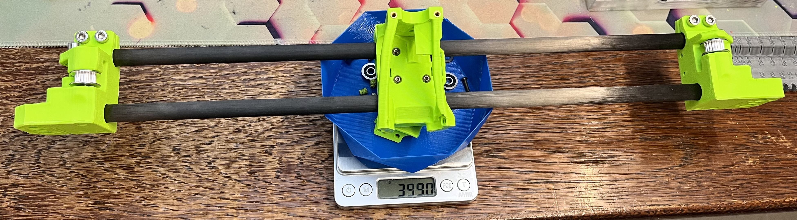
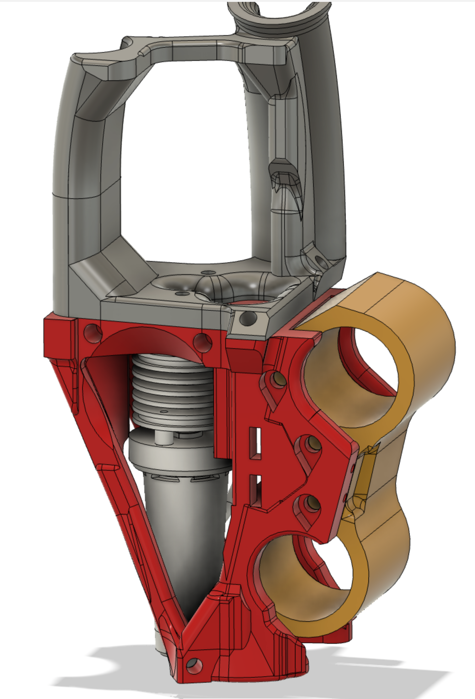
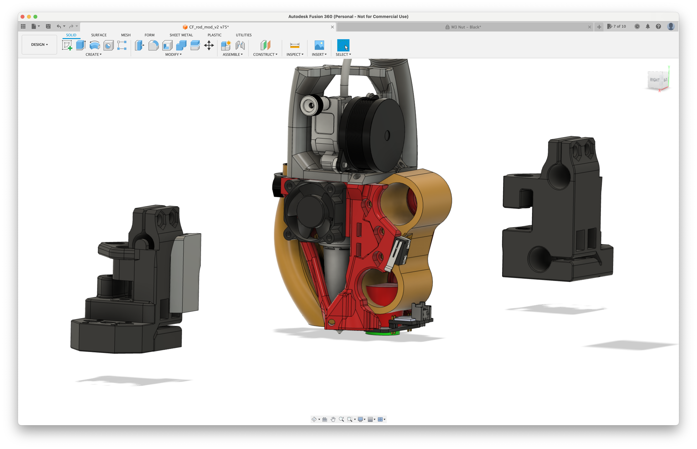

# CF ROD MOD
a carbon fiber mod with rods instead of a square x-beam and without the linear rails
- extruder > Hextrudort
- hotend > Goliath
- no other combinations are currently supported, but the fusion file is available so knock yourself out :-)

THIS MOD IS STILL ALPHA!

This mod is designed to essentially reduce the weight on the x axis of the gantry of a Voron 2.4 by about half. It uses 12mm carbon fiber rods and IGUS bushings. As this mod is still ALPHA. 

current version v3 - changelog
- the carriage has been completely redesigned. It is now printed on its side, thereby allowing very tight tolerances. it also allows to print easily modify the spacing between the bushings as well as the diameter of the cut-out. This way one can simply print a couple of them in various sizes and use the one that fits best. This is all in all a big step into the right direction, because now the normal IGUS RJ4J bushings can be ordered and used, even if the CF rods are not up to specs. One simply uses the pressure of the carriage on the IGUS bushings, to tighten thing so the desired fit. This also means, the bushings do not need to be secured anymore, as they simply hold with the pressure of the carriage, while still gliding smoothing on the CF rod. However the sides of the toolhead are designed in way, that would still hold the bushing, should they slip out.
- the sketch to easily modify the spacings is included
- accordingly the toolhead had to modified to accommodate the new carriage, which included strengthening of some parts on the toolhead. No other functional changes have been made. 
- currently only supports Beacon3D. If you ready this, just buy 2 or 3. They are well with the money. I will add klicky support, if this version is successful enough  and holds up to my expectations. 

older versions... moved to a subfolder, just FYI and no further developemnt on those:
- compact > rod closer together and the AB joints therefore shorter
- hightower > rods further apart, improving vertical stability, but may have issues with binding of the IGUS as well as torque on the AB joints
- hightower dual rail > using MGN9 rails on the top and bottom of the Y axis, improving stability but also increasing the weight.

Log 2023-03-27 // FYI
After printing an testing the first version, following things came to light:
- B motor was loose… great stuff… all my measurements in the last 2 weeks are worthless. 
- the main issue however are tolerances. Buying an expensive CF rod from IGUS together with the Rj4J, which certainly is an option, would cost more than 100€, which all things considered, is still okay. Cheap CF from eBay or AliExpress will typically be not up to specs. One way I tried solving this, by allowing the bushings to be squished, changed the geometry and orientation etc… but nothing really worked well…. 
- I found out, that IGUS also sells the base material of its bushing as a normal 3D printable filament. This for one solves the tolerance issues and while not cheap, about 70€ for a 750g spool, you can simply measure and test-print you own bushings. Once you have perfectly smooth bushing on the given CF rod, you can adjust the toolhead tolerances accordingly.
- Since I am now aware of the IGUS filament, a bunch of new ideas come to mind. For example a aluminium square tube 22x20mm, which is about 175g for a 430mm long tube, could be used as rail and a custom bushing around it. More to come on this idea.
- the toolhead can now only be swapped by taking out the whole x-axis. This is a trade off, better stability but a bit more work
END LOG

fully assmebled with the toolhead-carriage module >> 399g (minus 18.1g for missing titianium screws >> 380,9g)

The ultra light weight full aluminium X (Fystec ultra light aluminium X beam and light weight aluminium CNC'ed AB joints) with all titianum screws ends up at 490.2g.
The Carbon Fiber ROD MOD comes in at 380,9g* (399g but I was missing some titanium screws / nuts).

490,2g - 380,9g = 109,3g or 77.7% > 22.3% lighter

