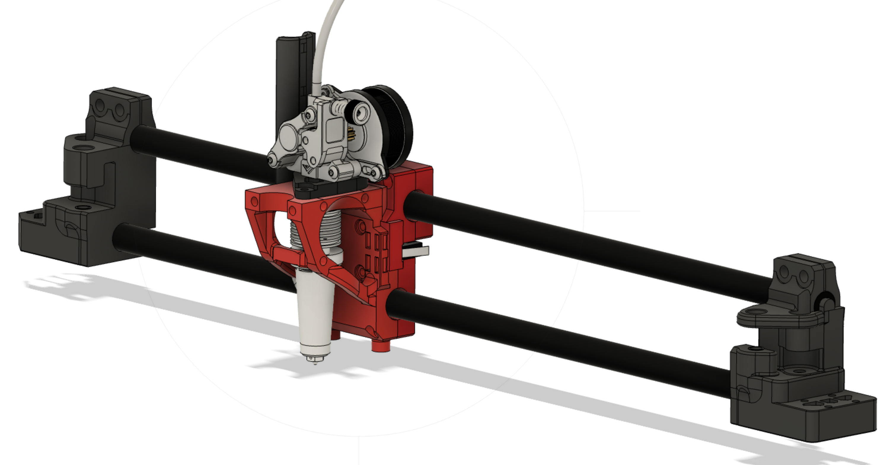
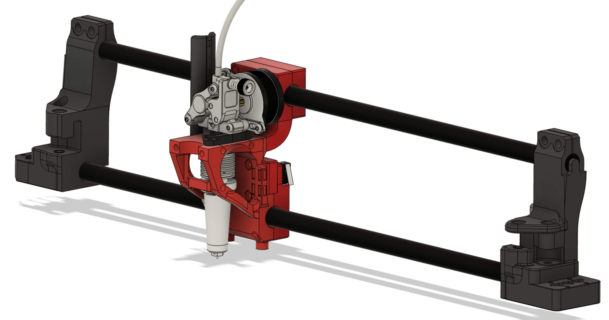
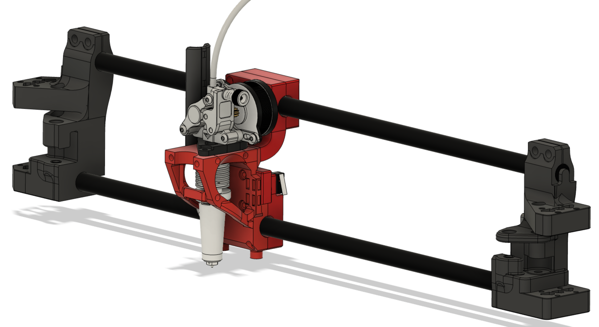

# CF ROD MOD
a carbon fiber mod with rods instead of a square x-beam and without the linear rails

THIS MOD IS STILL ALPHA!

This mod is designed to essentially reduce the weight on the x axis of the gantry of a Voron 2.4 by about half. It uses 12mm carbon fiber rods and IGUS bushings. As this mod is still ALPHA, currently 3 version are prepared. 
- compact > rod closer together and the AB joints therefore shorter
- hightower > rods further apart, improving vertical stability, but may have issues with binding of the IGUS as well as torque on the AB joints
- hightower dual rail > using MGN9 rails on the top and bottom of the Y axis, improving stability but also increasing the weight.

Currently pre-testing calculations are ongoing. After those, the most promising mod will be tested. I will update GitHub with results / graphs.

BOM
- 2x M3x10 flat head
- 2x M3x22 flat head
- 2x M3x22
- 4x M3x16
- 4x M5x20 
- 4x M5 nuts
- 4x M5x16
- 2x M5x20 thick head
- 1x M5x25 thick head
- 1x M5x30 thick head
- IGUS drylin RJ4JP-01
- CF rods 12mm x 1meter (466mm and 458mm)
- heat inserts

Where flat head (BHCS) or thick head (SHCS) is meantioned, it should be used as such. The others may be either one. Uusing flat heads where possible will save some extra weight.

**for documentation**
**none titanium screws / nuts in my build:**
- 8x M5 nuts > 8g total >> 4g with titanium
- 4x M5x16 > 14g > 7g w.t.
- 2x M5x20 > 8,2g > 4,1g w.t.
- 1x M5x25 > 4,6 > 2,3g w.t.
- 1x M5x30 > 5,4g > 2,7g w.t.

fully assmebled with the toolhead-carriage module >> 399g (minus 18.1g for missing titianium screws >> 380,9g)

The ultra light weight full aluminium X (Fystec ultra light aluminium X beam and light weight aluminium CNC'ed AB joints) with all titianum screws ends up at 490.2g.
The Carbon Fiber ROD MOD comes in at 380,9g* (399g but I was missing some titanium screws / nuts).

490,2g - 380,9g = 109,3g or 77.7% > 22.3% lighter

other versions (not tested as the compact version showed the best CG location)

